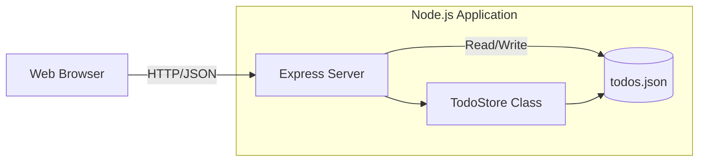
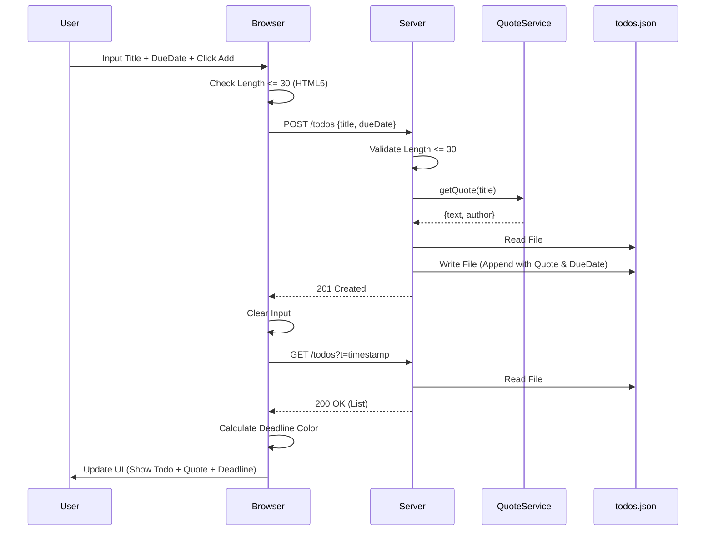
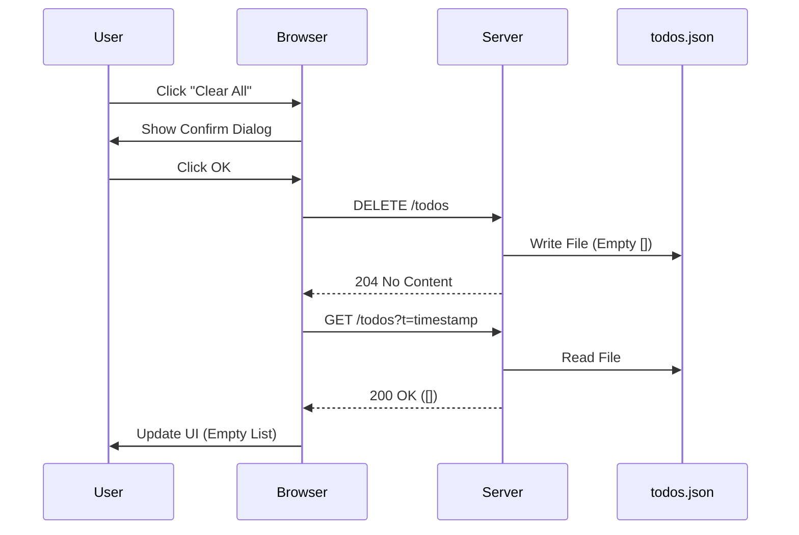

# Architecture Design

## 1. System Context
The system consists of a generic web browser client interacting with a monolithic Node.js server. The server handles both static file serving and API requests. Data is stored in a flat JSON file on the local filesystem.

## 2. Component Design

### 2.1. Client (Frontend)
*   **Responsibility:** Render UI, capture user input, validate length locally, call REST API.
*   **Key Logic:**
    *   `fetchTodos()`: GET with timestamp to avoid cache.
    *   `renderTodos()`: Clear and rebuild DOM list.
    *   `applyFontSize()`: Update CSS variables based on user selection.
    *   `sortTodos()`: Client-side sorting based on user criteria (Deadline/Created).
    *   Event Listeners: Handle Add, Toggle, Delete, Clear All, Font Change, Sort Change actions.

### 2.2. Server (Backend)
*   **Responsibility:** Serve static assets, validate API requests, manage data persistence.
*   **Key Components:**
    *   `src/index.ts`: Route definitions, request validation (30 char limit).
    *   `src/store.ts`: Abstracted file I/O operations (`readData`, `writeData`, `add`, `update`, `delete`, `deleteAll`).
    *   `src/quoteService.ts`: Dictionary-based quote matching logic.

## 3. Key User Flows

### 3.1. Add Todo Flow
User enters text and clicks "Add".

### 3.2. Delete All Flow
User clicks "Clear All".

