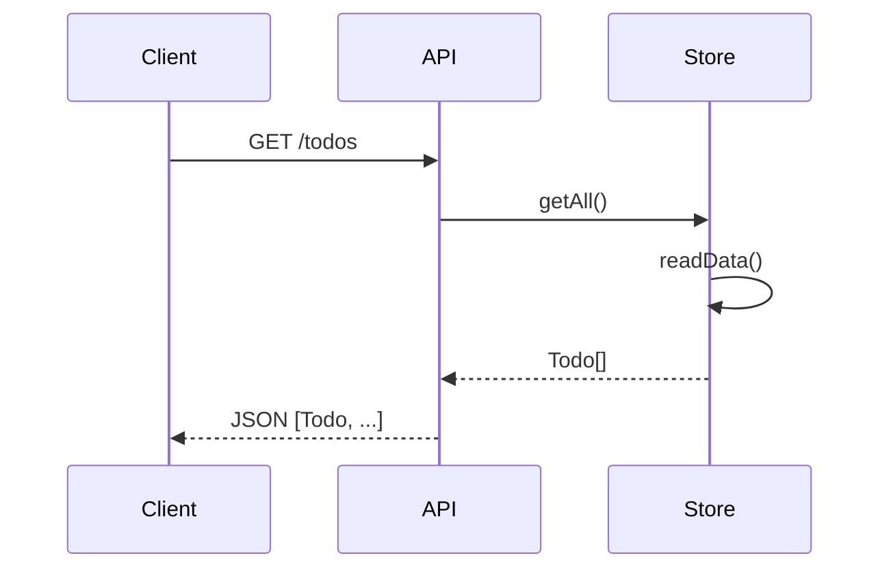
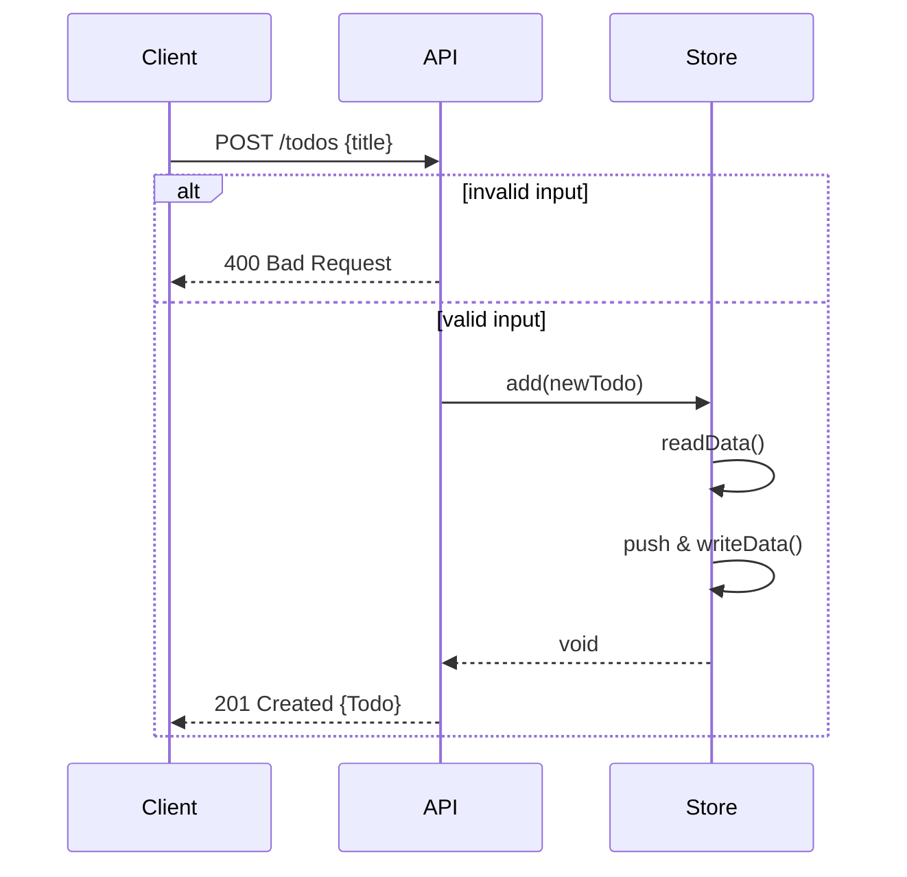
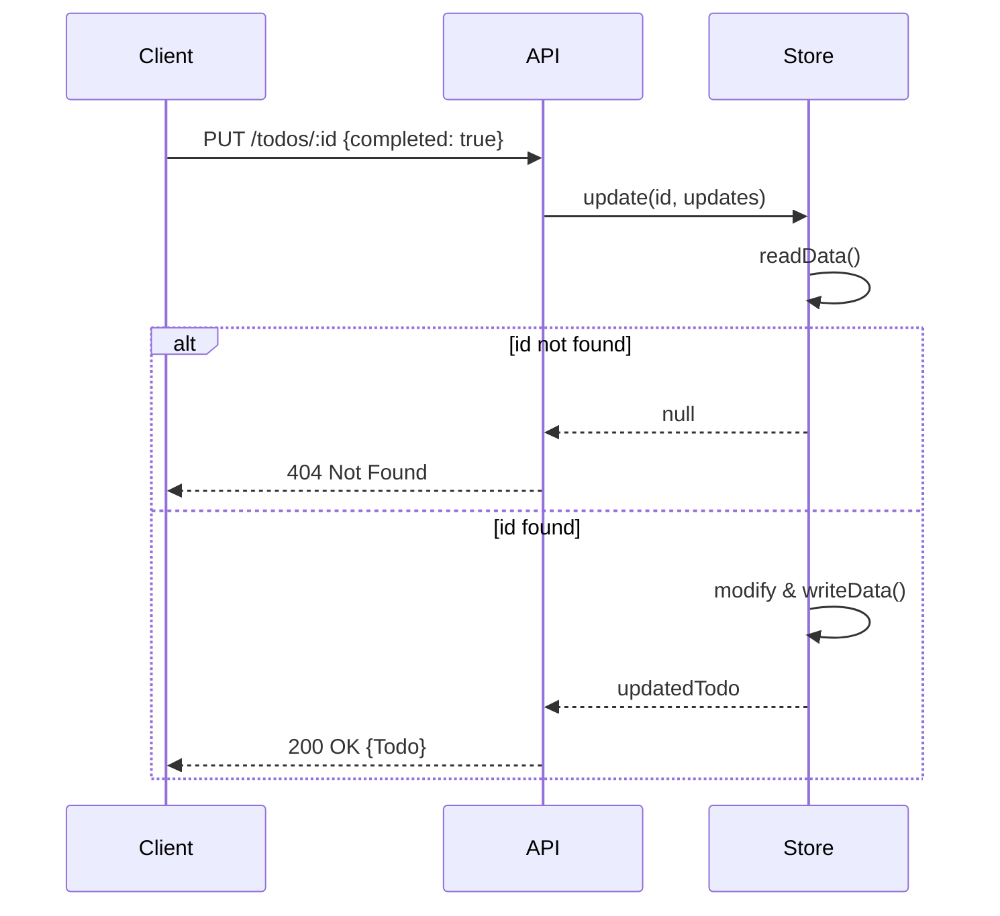
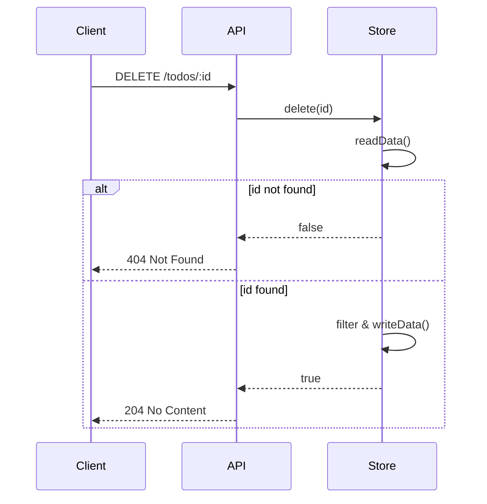
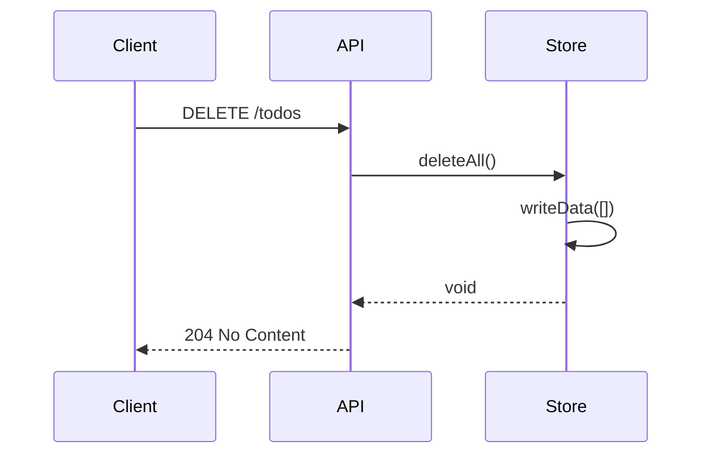

# API Detailed Design

## 1. Retrieve All Todos
Returns the full list of tasks.

*   **Endpoint:** `GET /todos`
*   **Response:** `200 OK` (Array of Todo objects)
*   **Error:** `500 Internal Server Error` (File read failure)

## 2. Create Todo
Creates a new task with a generated UUID.

*   **Endpoint:** `POST /todos`
*   **Body:** `{ "title": "string" }`
*   **Validation:**
    *   `title` required.
    *   `title` length <= 30 characters.
*   **Processing:**
    *   Generates UUID v4.
    *   Sets `createdAt` to current ISO timestamp.
    *   Sets `completed` to false.
*   **Response:**
    *   `201 Created` (The created Todo object)
    *   `400 Bad Request` (Missing title or too long)
    *   `500 Internal Server Error`

## 3. Update Todo
Updates the status or title of an existing task.

*   **Endpoint:** `PUT /todos/:id`
*   **Body:** `{ "title"?: "string", "completed"?: boolean }`
*   **Validation:**
    *   If `title` is present, length <= 30 characters.
*   **Response:**
    *   `200 OK` (Updated Todo object)
    *   `400 Bad Request` (Title too long)
    *   `404 Not Found` (ID does not exist)
    *   `500 Internal Server Error`

## 4. Delete Todo
Removes a specific task.

*   **Endpoint:** `DELETE /todos/:id`
*   **Response:**
    *   `204 No Content` (Success)
    *   `404 Not Found` (ID does not exist)
    *   `500 Internal Server Error`

## 5. Delete All Todos
Removes all tasks from the storage.

*   **Endpoint:** `DELETE /todos`
*   **Response:**
    *   `204 No Content` (Success)
    *   `500 Internal Server Error`

